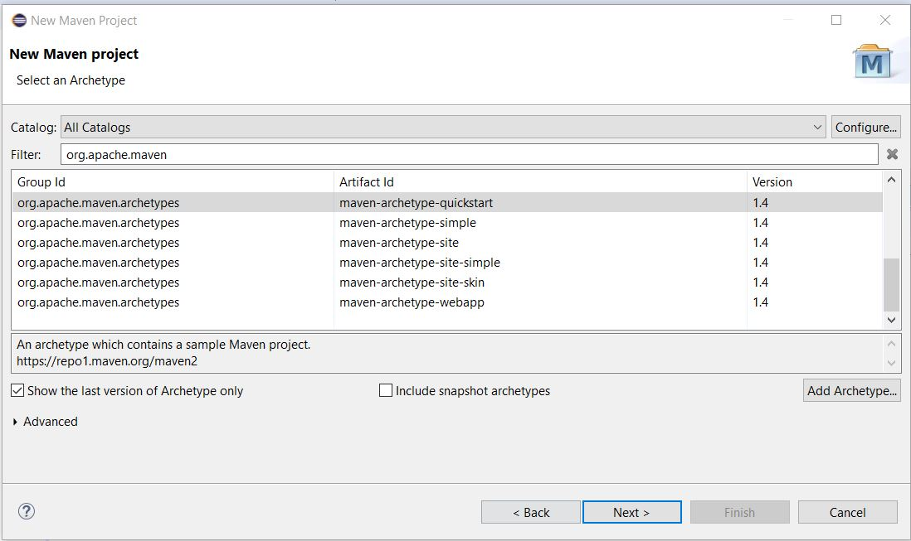
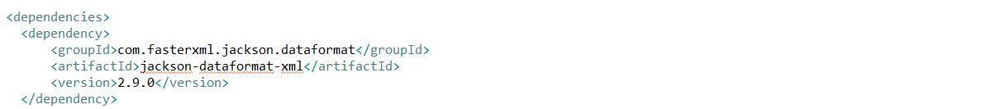

# CRD-json

## Freshworks – Backend Assignment

Build a file-based key-value data store that supports the basic CRD (create, read, and delete) operations. This data store is meant to be used as a local storage for one single process on one laptop. The data store must be exposed as a library to clients that can instantiate a class and work with the data store.

# PROCESS INVOLVED
## eclipse IDE is used in creating this project

#### Initially maven project is created.

* Jackson(is a very popular and efficient java based library to serialize or map java objects to JSON and vice versa.)
JSON data service is used for handling(CREATE,READ,DELETE) data.

* Jackson dependency is added in pom.xml

### ObjectMapper - 
#### ObjectMapper is the main actor class of Jackson library. ObjectMapper provides functionality for reading and writing JSON.

` ` `
ObjectMapper mapper = new ObjectMapper();
` ` `

* Json data are saved in seperate *TEXT* file in *personOut.json* in location *d:\\json\\personsOut.json*.

 

* it will reliably create itself in a reasonable location on the laptop *d:\\json\\personsOut.json*.  

### Inserting data and STORING IT IN A LOCAL SYSTEM FILE *personsOut.json*

## Reading data from local stored JSON file

## Deleting data from local stored JSON file 

## Data after deleting ID

## Data Already Exist
* Create is invoked for an existing key, an appropriate error is returned.

## Exit from System..
